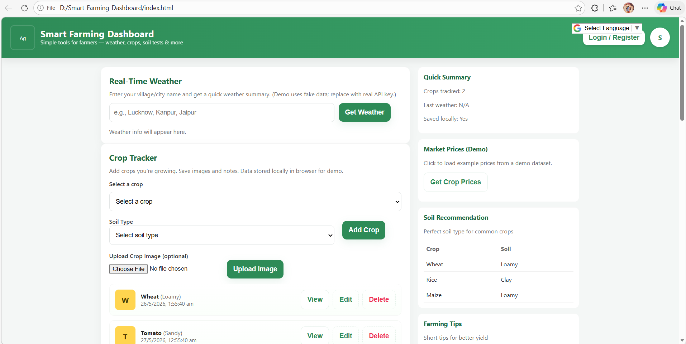
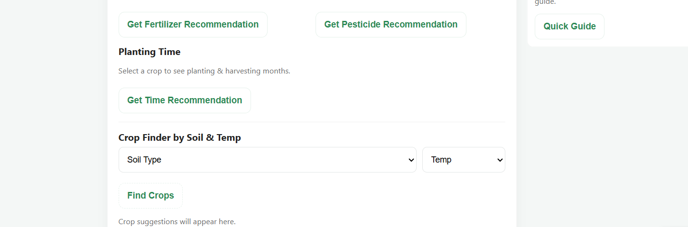
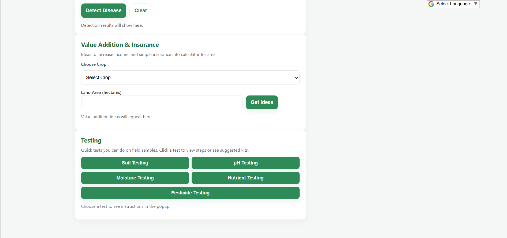

#  Smart Farming Dashboard

A modern and responsive Smart Farming Dashboard designed to help farmers manage agricultural activities efficiently.

This project provides weather updates, crop tracking, fertilizer recommendations, disease detection, testing guidance, and market price information in a single platform.

Built using **HTML, CSS, and JavaScript** with a clean and farmer-friendly interface.

---

#  Live Features

 Real-Time Weather System  
 Crop Tracking Dashboard  
 Fertilizer Recommendations  
 Pesticide Suggestions  
 Disease Detection Module  
 Crop Recommendation System  
 Soil Type Selection  
 Market Price Display  
 Value Addition Suggestions  
 Testing Guidance Section  
 Popup Modal System  
 Google Translate Integration  
 Local Storage Data Saving  
 Responsive UI Design  
 Mobile Friendly Layout  

---

#  Screenshots

##  Smart Farming Dashboard



---

##  Features Section



---

##  Weather & Crop Monitoring



---

#  Tech Stack

| Technology | Usage |
|---|---|
| HTML5 | Structure |
| CSS3 | Styling |
| JavaScript | Functionality |
| LocalStorage API | Data Storage |
| Google Translate Widget | Multi-language Support |

---

#  Project Structure

```bash
Smart-Farming-Dashboard/

│
├── index.html
├── README.md
│
├── screenshots/
│   ├── Screenshot-1.png
│   ├── Screenshot-2.png
│   └── Screenshot-3.png
│
└── assets/
